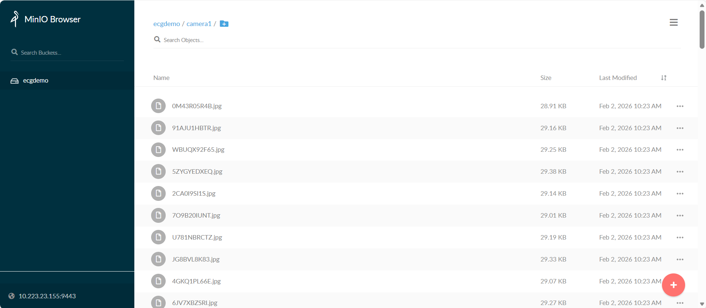

# Deploy multiple instances using Helm charts

## Prerequisites

- Ensure you have the **minimum system requirements** for this application.
- K8s installation on single or multi node must be done as pre-requisite to continue the following deployment. Note: The kubernetes cluster is set up with `kubeadm`, `kubectl` and `kubelet` packages on single and multi nodes with `v1.30.2`.
  Refer to tutorials online to setup kubernetes cluster on the web with host OS as ubuntu 22.04 and/or ubuntu 24.04.
- For helm installation, refer to [helm website](https://helm.sh/docs/intro/install/)

## Setup the application

> **Note**: The following instructions assume Kubernetes is already running in the host system with helm package manager installed.

1. Clone the **edge-ai-suites** repository and change into industrial-edge-insights-vision directory. The directory contains the utility scripts required in the instructions that follows.
    ```sh
    git clone https://github.com/open-edge-platform/edge-ai-suites.git
    cd edge-ai-suites/manufacturing-ai-suite/industrial-edge-insights-vision/
    ```
2. Create a `config.yml` file that includes the sample_apps, instances of each of the sample_apps and their corresponding unique ports :
    
     ```bash
    touch config.yml && code config.yml
    ```

    Example:

    ```bash
    pallet-defect-detection:
      pdd1:
        NGINX_HTTP_PORT: 30080
        NGINX_HTTPS_PORT: 30443
        COTURN_PORT: 30478
        S3_STORAGE_PORT: 30800
      pdd2:
        NGINX_HTTP_PORT: 30081
        NGINX_HTTPS_PORT: 30444
        COTURN_PORT: 30479
        S3_STORAGE_PORT: 30801

    weld-porosity:
      weld1:
        NGINX_HTTP_PORT: 30082
        NGINX_HTTPS_PORT: 30445
        COTURN_PORT: 30480
        S3_STORAGE_PORT: 30802
    ```

3.  Edit the HOST_IP, proxy and other environment variables in all the `helm/values_<SAMPLE_APP>.yaml` as follows
    ```yaml
    env:
        HOST_IP: <HOST_IP>   # host IP address
        MINIO_ACCESS_KEY: <DATABASE USERNAME> #  example: minioadmin
        MINIO_SECRET_KEY: <DATABASE PASSWORD> #  example: minioadmin
        http_proxy: <http proxy> # proxy details if behind proxy
        https_proxy: <https proxy>
        POSTGRES_PASSWORD: <POSTGRES PASSWORD> #  example: intel1234
        MR_URL: https://<HOST_IP>:30443/registry/ # Model reigstry URL
        SAMPLE_APP: pallet-defect-detection # application directory
    webrtcturnserver:
        username: <username>  # WebRTC credentials e.g. intel1234
        password: <password>
    ```
4.  Install pre-requisites. 
    ```sh
    ./setup.sh helm
    ```
    - This sets up application pre-requisites, download artifacts, sets executable permissions for scripts etc. Downloaded resource directories.
    - It creates folders in helm/temp_apps/<SAMPLE_APP>/<INSTANCE_NAME> that contains the configs folder, .env file, payload.json, pipeline-server-config.json and values.yaml.
    - Updates the ports mentioned in config.yml to the values.yaml in its respective places.

## Deploy the application

### Install helm charts

5.  Install the helm chart for all instances
    ```sh
    ./run.sh helm_install
    ```
    After installation, check the status of the running pods for each instance:
    ```sh
    kubectl get pods -n <INSTANCE_NAME>
    ```
    To view logs of a specific pod, replace `<pod_name>` with the actual pod name from the output above:
    ```sh
    kubectl logs -n apps -f <pod_name>
    ```

6.  Copy the resources such as video and model from local directory to the to the `dlstreamer-pipeline-server` pod to make them available for application while launching pipelines.
    ```sh
    # Below is an example for Pallet Defect Detection. Please adjust the source path of models and videos appropriately for other sample applications.

    POD_NAME=$(kubectl get pods -n <INSTANCE_NAME> -o jsonpath='{.items[*].metadata.name}' | tr ' ' '\n' | grep deployment-dlstreamer-pipeline-server | head -n 1)

    kubectl cp resources/pallet-defect-detection/videos/warehouse.avi $POD_NAME:/home/pipeline-server/resources/videos/ -c dlstreamer-pipeline-server -n <INSTANCE_NAME>

    kubectl cp resources/pallet-defect-detection/models/* $POD_NAME:/home/pipeline-server/resources/models/ -c dlstreamer-pipeline-server -n <INSTANCE_NAME>
    ```
7.  Fetch the list of pipeline loaded available to launch for all instances
    ```sh
    ./sample_list.sh helm
    ```
    This lists the pipeline loaded in DLStreamer Pipeline Server.

    Output:
    ```sh
    -------------------------------------------
    Status of: pdd1 (SAMPLE_APP: pallet-defect-detection)
    -------------------------------------------
    Environment variables loaded from /home/intel/IRD/edge-ai-suites/manufacturing-ai-suite/industrial-edge-insights-vision/helm/temp_apps/pallet-defect-detection/pdd1/.env
    Running sample app: pallet-defect-detection
    Using Helm deployment - curl commands will use: 10.223.23.150:30443
    Checking status of dlstreamer-pipeline-server...
    Server reachable. HTTP Status Code: 200
    Getting list of loaded pipelines...
    Loaded pipelines:
    [
    {
        "description": "DL Streamer Pipeline Server pipeline",
        "name": "user_defined_pipelines",
        "parameters": {
        "properties": {
            "detection-properties": {
            "element": {
                "format": "element-properties",
                "name": "detection"
            }
            }

            ...
    -------------------------------------------
    Status of: pdd2 (SAMPLE_APP: pallet-defect-detection)
    -------------------------------------------
    Environment variables loaded from /home/intel/IRD/edge-ai-suites/manufacturing-ai-suite/industrial-edge-insights-vision/helm/temp_apps/pallet-defect-detection/pdd2/.env
    Running sample app: pallet-defect-detection
    Using Helm deployment - curl commands will use: 10.223.23.150:30444
    Checking status of dlstreamer-pipeline-server...
    Server reachable. HTTP Status Code: 200
    Getting list of loaded pipelines...
    Loaded pipelines:
    [
    {
        "description": "DL Streamer Pipeline Server pipeline",
        "name": "user_defined_pipelines",
        "parameters": {
        "properties": {
            "detection-properties": {
            "element": {
                "format": "element-properties",
                "name": "detection"
            }
            }
        ...

    -------------------------------------------
    Status of: weld1 (SAMPLE_APP: weld-porosity)
    -------------------------------------------
    Environment variables loaded from /home/intel/IRD/edge-ai-suites/manufacturing-ai-suite/industrial-edge-insights-vision/helm/temp_apps/weld-porosity/weld1/.env
    Running sample app: weld-porosity
    Using Helm deployment - curl commands will use: 10.223.23.150:30445
    Checking status of dlstreamer-pipeline-server...
    Server reachable. HTTP Status Code: 200
    Getting list of loaded pipelines...
    Loaded pipelines:
    [
    {
        "description": "DL Streamer Pipeline Server pipeline",
        "name": "user_defined_pipelines",
        "parameters": {
        "properties": {
            "classification-properties": {
            "element": {
                "format": "element-properties",
                "name": "classification"
            }
            }
        ...
    ]
    ```

### Start AI pipelines

#### Start pipeline for all instances

8.  Start the pipeline for all instances in the config.yml file
    ```sh
    ./sample_start.sh helm 
    ```

    Example Output:
    ```sh
    No pipeline specified. Starting the first pipeline.

    ------------------------------------------
    Processing instance: pdd1 from SAMPLE_APP: pallet-defect-detection
    ------------------------------------------
    Environment variables loaded from /home/intel/IRD/edge-ai-suites/manufacturing-ai-suite/industrial-edge-insights-vision/helm/temp_apps/pallet-defect-detection/pdd1/.env
    Running sample app: pallet-defect-detection
    Using Helm deployment - curl commands will use: <HOST_IP>:<NGINX_HTTPS_PORT>
    Checking status of dlstreamer-pipeline-server...
    Server reachable. HTTP Status Code: 200
    Loading payload from /home/intel/IRD/edge-ai-suites/manufacturing-ai-suite/industrial-edge-insights-vision/helm/temp_apps/pallet-defect-detection/pdd1/payload.json
    Payload loaded successfully.
    Starting first pipeline: pallet_defect_detection
    Launching pipeline: pallet_defect_detection
    Extracting payload for pipeline: pallet_defect_detection
    Found 1 payload(s) for pipeline: pallet_defect_detection
    Payload for pipeline 'pallet_defect_detection'  Response: "b34dc150062e11f1863a15371702ae06"

    ------------------------------------------
    Processing instance: pdd2 from SAMPLE_APP: pallet-defect-detection
    ------------------------------------------
    Environment variables loaded from /home/intel/IRD/edge-ai-suites/manufacturing-ai-suite/industrial-edge-insights-vision/helm/temp_apps/pallet-defect-detection/pdd2/.env
    Running sample app: pallet-defect-detection
    Using Helm deployment - curl commands will use: <HOST_IP>:<NGINX_HTTPS_PORT>
    Checking status of dlstreamer-pipeline-server...
    Server reachable. HTTP Status Code: 200
    Loading payload from /home/intel/IRD/edge-ai-suites/manufacturing-ai-suite/industrial-edge-insights-vision/helm/temp_apps/pallet-defect-detection/pdd2/payload.json
    Payload loaded successfully.
    Starting first pipeline: pallet_defect_detection
    Launching pipeline: pallet_defect_detection
    Extracting payload for pipeline: pallet_defect_detection
    Found 1 payload(s) for pipeline: pallet_defect_detection
    Payload for pipeline 'pallet_defect_detection' Response: "b35b2a20062e11f1b059efacc0acb924"

    ------------------------------------------
    Processing instance: weld1 from SAMPLE_APP: weld-porosity
    ------------------------------------------
    Environment variables loaded from /home/intel/IRD/edge-ai-suites/manufacturing-ai-suite/industrial-edge-insights-vision/helm/temp_apps/weld-porosity/weld1/.env
    Running sample app: weld-porosity
    Using Helm deployment - curl commands will use: 1<HOST_IP>:<NGINX_HTTPS_PORT>
    Checking status of dlstreamer-pipeline-server...
    Server reachable. HTTP Status Code: 200
    Loading payload from /home/intel/IRD/edge-ai-suites/manufacturing-ai-suite/industrial-edge-insights-vision/helm/temp_apps/weld-porosity/weld1/payload.json
    Payload loaded successfully.
    Starting first pipeline: weld_porosity_classification
    Launching pipeline: weld_porosity_classification
    Extracting payload for pipeline: weld_porosity_classification
    Found 1 payload(s) for pipeline: weld_porosity_classification
    Payload for pipeline 'weld_porosity_classification'  Response: "b366127e062e11f19d9a75f141417eac"
    ```
9. Access the WebRTC stream

    ```bash
    https://<HOST_IP>:<NGINX_HTTPS_PORT>/mediamtx/<peer-id>
    ```

#### Start pipeline for a particular instance only

10. Fetch the list of pipeline for <INSTANCE_NAME>:

    ```bash
    ./sample_list.sh helm -i <INSTANCE_NAME>
    ```

    Example Output:
    ```bash
    Instance name set to: pdd1
    Found SAMPLE_APP: pallet-defect-detection for INSTANCE_NAME: pdd1
    Environment variables loaded from /home/intel/IRD/edge-ai-suites/manufacturing-ai-suite/industrial-edge-insights-vision/helm/temp_apps/pallet-defect-detection/pdd1/.env
    Running sample app: pallet-defect-detection
    Using default deployment - curl commands will use: <HOST_IP>:<NGINX_HTTPS_PORT>
    Checking status of dlstreamer-pipeline-server...
    Server reachable. HTTP Status Code: 200
    Getting list of loaded pipelines...
    Loaded pipelines:
    [
    {
        "description": "DL Streamer Pipeline Server pipeline",
        "name": "user_defined_pipelines",
        "parameters": {
        "properties": {
            "detection-properties": {
            "element": {
                "format": "element-properties",
                "name": "detection"
            }
            }
            ...
    ]
    ```

11. Start the pipeline for <INSTANCE_NAME>:

    ```bash
    ./sample_start.sh -i <INSTANCE_NAME> -p <PIPELINE_NAME>
    ```
    Output:

    ```bash
    Instance name set to: pdd2
    Starting specified pipeline(s)...
    Found SAMPLE_APP: pallet-defect-detection for INSTANCE_NAME: pdd2
    Environment variables loaded from /home/intel/IRD/edge-ai-suites/manufacturing-ai-suite/industrial-edge-insights-vision/helm/temp_apps/pallet-defect-detection/pdd2/.env
    Running sample app: pallet-defect-detection
    Using Helm deployment - curl commands will use: <HOST_IP>:<NGINX_HTTPS_PORT>
    Checking status of dlstreamer-pipeline-server...
    Server reachable. HTTP Status Code: 200
    Loading payload from /home/intel/IRD/edge-ai-suites/manufacturing-ai-suite/industrial-edge-insights-vision/helm/temp_apps/pallet-defect-detection/pdd2/payload.json
    Payload loaded successfully.
    Starting pipeline: pallet_defect_detection
    Launching pipeline: pallet_defect_detection
    Extracting payload for pipeline: pallet_defect_detection
    Found 1 payload(s) for pipeline: pallet_defect_detection
    Payload for pipeline 'pallet_defect_detection'  Response: "f3a34cd5062f11f1ab8defacc0acb924"
    ```

12. Acess WebRTC stream:
    Open a browser and navigate to 

    ```bash
    https://<HOST_IP>:<NGINX_HTTPS_PORT>/mediamtx/<peer-id>/
    ```

### Monitor Applications

13.  Get status of pipeline instance(s) of all instances.

        ```bash
        ./sample_status.sh helm
        ```

     This command lists status of pipeline instances launched during the lifetime of sample application of all instances in the config file

     Output:

        ```bash
            No arguments provided. Fetching status for all pipeline instances.
            Config file found. Fetching status for all instances defined in /home/intel/IRD/edge-ai-suites/manufacturing-ai-suite/industrial-edge-insights-vision/config.yml
            Processing instance: pdd1 from sample app: pallet-defect-detection
            Environment variables loaded from /home/intel/IRD/edge-ai-suites/manufacturing-ai-suite/industrial-edge-insights-vision/helm/temp_apps/pallet-defect-detection/pdd1/.env
            Running sample app: pallet-defect-detection
            Using Helm deployment - curl commands will use: <HOST_IP>:<NGINX_HTTPS_PORT>
            [
            {
                "avg_fps": 30.003179236553294,
                "elapsed_time": 97.189706325531,
                "id": "b34dc150062e11f1863a15371702ae06",
                "message": "",
                "start_time": 1770693307.7875352,
                "state": "COMPLETED"
            },
            {
                "avg_fps": 30.1419409008953,
                "elapsed_time": 5.706332683563232,
                "id": "2b51cf36063111f1b19b15371702ae06",
                "message": "",
                "start_time": 1770694367.6247275,
                "state": "RUNNING"
            }
            ]
            Processing instance: pdd2 from sample app: pallet-defect-detection
            Environment variables loaded from /home/intel/IRD/edge-ai-suites/manufacturing-ai-suite/industrial-edge-insights-vision/helm/temp_apps/pallet-defect-detection/pdd2/.env
            Running sample app: pallet-defect-detection
            Using Helm deployment - curl commands will use: <HOST_IP>:<NGINX_HTTPS_PORT>
            [
            {
                "avg_fps": 30.00630534767508,
                "elapsed_time": 97.17957949638367,
                "id": "b35b2a20062e11f1b059efacc0acb924",
                "message": "",
                "start_time": 1770693308.1801755,
                "state": "COMPLETED"
            },
            {
                "avg_fps": 30.075114986748083,
                "elapsed_time": 5.586012363433838,
                "id": "2b632863063111f18b4cefacc0acb924",
                "message": "",
                "start_time": 1770694367.766532,
                "state": "RUNNING"
            }
            ]
            Processing instance: weld1 from sample app: weld-porosity
            Environment variables loaded from /home/intel/IRD/edge-ai-suites/manufacturing-ai-suite/industrial-edge-insights-vision/helm/temp_apps/weld-porosity/weld1/.env
            Running sample app: weld-porosity
            Using Helm deployment - curl commands will use: <HOST_IP>:<NGINX_HTTPS_PORT>
            [
            {
                "avg_fps": 30.004351657011913,
                "elapsed_time": 22.463412046432495,
                "id": "b366127e062e11f19d9a75f141417eac",
                "message": "",
                "start_time": 1770693307.6337888,
                "state": "COMPLETED"
            },
            {
                "avg_fps": 30.20726493152364,
                "elapsed_time": 5.462261199951172,
                "id": "2b71f4a2063111f1946d75f141417eac",
                "message": "",
                "start_time": 1770694367.907302,
                "state": "RUNNING"
            }
            ]
            ```

14. Check status of only a particular instance:

    ```bash
    ./sample_status.sh helm -i <INSTANCE_NAME>
    ```

15. Check status of a particular instance_id of an instance

    ```bash
    ./sample_status.sh helm -i <INSTANCE_NAME> --id <INSTANCE_ID>
    ```

### Stop Applications


16. Stop all pipelines of all instances

    ```bash
    ./sample_stop.sh helm
    ```

    Output
    ```bash
    No pipelines specified. Stopping all pipeline instances

    -------------------------------------------
    Processing instance: pdd1 (SAMPLE_APP: pallet-defect-detection)
    -------------------------------------------
    Environment variables loaded from /home/intel/IRD/edge-ai-suites/manufacturing-ai-suite/industrial-edge-insights-vision/helm/temp_apps/pallet-defect-detection/pdd1/.env
    Running sample app: pallet-defect-detection
    Using Helm deployment - curl commands will use: <HOST_IP>:<NGINX_HTTPS_PORT>
    Checking status of dlstreamer-pipeline-server...
    Server reachable. HTTP Status Code: 200
    Instance list fetched successfully. HTTP Status Code: 200
    Found 1 running pipeline instances.
    Stopping pipeline instance with ID: 88065593063211f1a83815371702ae06
    Pipeline instance with ID '88065593063211f1a83815371702ae06' stopped successfully. Response: {
    "avg_fps": 30.02882915265665,
    "elapsed_time": 8.391932249069214,
    "id": "88065593063211f1a83815371702ae06",
    "message": "",
    "start_time": 1770694952.6537187,
    "state": "RUNNING"
    }

    -------------------------------------------
    Processing instance: pdd2 (SAMPLE_APP: pallet-defect-detection)
    -------------------------------------------
    Environment variables loaded from /home/intel/IRD/edge-ai-suites/manufacturing-ai-suite/industrial-edge-insights-vision/helm/temp_apps/pallet-defect-detection/pdd2/.env
    Running sample app: pallet-defect-detection
    Using Helm deployment - curl commands will use: <HOST_IP>:<NGINX_HTTPS_PORT>
    Checking status of dlstreamer-pipeline-server...
    Server reachable. HTTP Status Code: 200
    Instance list fetched successfully. HTTP Status Code: 200
    Found 1 running pipeline instances.
    Stopping pipeline instance with ID: 881ff32a063211f1b67defacc0acb924
    Pipeline instance with ID '881ff32a063211f1b67defacc0acb924' stopped successfully. Response: {
    "avg_fps": 30.069598458700824,
    "elapsed_time": 8.380553007125854,
    "id": "881ff32a063211f1b67defacc0acb924",
    "message": "",
    "start_time": 1770694952.8342986,
    "state": "RUNNING"
    }

    -------------------------------------------
    Processing instance: weld1 (SAMPLE_APP: weld-porosity)
    -------------------------------------------
    Environment variables loaded from /home/intel/IRD/edge-ai-suites/manufacturing-ai-suite/industrial-edge-insights-vision/helm/temp_apps/weld-porosity/weld1/.env
    Running sample app: weld-porosity
    Using Helm deployment - curl commands will use: <HOST_IP>:<NGINX_HTTPS_PORT>
    Checking status of dlstreamer-pipeline-server...
    Server reachable. HTTP Status Code: 200
    Instance list fetched successfully. HTTP Status Code: 200
    Found 1 running pipeline instances.
    Stopping pipeline instance with ID: 88318dd1063211f1bd9675f141417eac
    Pipeline instance with ID '88318dd1063211f1bd9675f141417eac' stopped successfully. Response: {
    "avg_fps": 30.144217405495226,
    "elapsed_time": 8.32663083076477,
    "id": "88318dd1063211f1bd9675f141417eac",
    "message": "",
    "start_time": 1770694953.002784,
    "state": "RUNNING"
    }
    ```

17. Stop pipelines of given instance

    ```bash
    ./sample_stop.sh helm -i <INSTANCE_NAME>
    ```
    Output:
    ```
    Found SAMPLE_APP: pallet-defect-detection for INSTANCE_NAME: pdd1
    Environment variables loaded from /home/intel/IRD/edge-ai-suites/manufacturing-ai-suite/industrial-edge-insights-vision/helm/temp_apps/pallet-defect-detection/pdd1/.env
    Running sample app: pallet-defect-detection
    Using Helm deployment - curl commands will use: <HOST_IP>:<NGINX_HTTPS_PORT>
    Checking status of dlstreamer-pipeline-server...
    Server reachable. HTTP Status Code: 200
    Instance list fetched successfully. HTTP Status Code: 200
    Found 1 running pipeline instances.
    Stopping pipeline instance with ID: f49ee13b063211f18ae815371702ae06
    Pipeline instance with ID 'f49ee13b063211f18ae815371702ae06' stopped successfully. Response: {
    "avg_fps": 30.113055800460913,
    "elapsed_time": 9.397908210754395,
    "id": "f49ee13b063211f18ae815371702ae06",
    "message": "",
    "start_time": 1770695134.8435106,
    "state": "RUNNING"
    }
    ```

18. Stop pipelines of an instance with a given instance_id:

    ```
    ./sample_stop.sh helm -i <INSTANCE_NAME> --id <INSTANCE_ID>
    ```
    Output:

    ```
    Found SAMPLE_APP: pallet-defect-detection for INSTANCE_NAME: pdd1
    Environment variables loaded from /home/intel/IRD/edge-ai-suites/manufacturing-ai-suite/industrial-edge-insights-vision/helm/temp_apps/pallet-defect-detection/pdd1/.env
    Running sample app: pallet-defect-detection
    Using Helm deployment - curl commands will use: <HOST_IP>:<NGINX_HTTPS_PORT>
    Checking status of dlstreamer-pipeline-server...
    Server reachable. HTTP Status Code: 200
    Stopping pipeline instance with ID: 4562a97f063311f19f4d15371702ae06
    Pipeline instance with ID '4562a97f063311f19f4d15371702ae06' stopped successfully. Response: {
    "avg_fps": 30.059924104470113,
    "elapsed_time": 15.868299961090088,
    "id": "4562a97f063311f19f4d15371702ae06",
    "message": "",
    "start_time": 1770695270.3738744,
    "state": "RUNNING"
    }
    ```

19. Uninstall the helm chart.
     ```sh
     ./run.sh helm_uninstall
     ```


## Storing frames to S3 storage

Applications can take advantage of S3 publish feature from DL Streamer Pipeline Server and use it to save frames to an S3 compatible storage.

1. Run all the steps mentioned in above [section](#setup-the-application) to setup the application.

2. Install the helm chart.

   ```sh
   ./run.sh helm_install
   ```

3. Copy the resources such as video and model from local directory to the `dlstreamer-pipeline-server` pod to make them available for application while launching pipelines.

   ```sh
   # Below is an example for Pallet Defect Detection. Please adjust the source path of models and videos appropriately for other sample applications.

   POD_NAME=$(kubectl get pods -n <INSTANCE_NAME> -o jsonpath='{.items[*].metadata.name}' | tr ' ' '\n' | grep deployment-dlstreamer-pipeline-server | head -n 1)

   kubectl cp resources/pallet-defect-detection/videos/warehouse.avi $POD_NAME:/home/pipeline-server/resources/videos/ -c dlstreamer-pipeline-server -n <INSTANCE_NAME>

   kubectl cp resources/pallet-defect-detection/models/* $POD_NAME:/home/pipeline-server/resources/models/ -c dlstreamer-pipeline-server -n <INSTANCE_NAME>
   ```

4. Install the package `boto3` in your python environment if not installed.

   It is recommended to create a virtual environment and install it there. You can run the following commands to add the necessary dependencies as well as create and activate the environment.

   ```sh
   sudo apt update && \
   sudo apt install -y python3 python3-pip python3-venv
   ```

   ```sh
   python3 -m venv venv && \
   source venv/bin/activate
   ```

   Once the environment is ready, install `boto3` with the following command

   ```sh
   pip3 install --upgrade pip && \
   pip3 install boto3==1.36.17
   ```

   > **Note:** DL Streamer Pipeline Server expects the bucket to be already present in the database. The next step will help you create one.

5. Create a S3 bucket using the following script.

   Update the `HOST_IP` and `S3_STORAGE_PORT` mentioned in config.yml for each instance and credentials with that of the running MinIO server. Name the file as `create_bucket_<INSTANCE_NAME>.py`.

   ```python
   import boto3
   url = "http://<HOST_IP>:<S3_STORAGE_PORT>"
   user = "<value of MINIO_ACCESS_KEY used in helm/temp_apps/SAMPLE_APP/INSTANCE_NAME/values.yaml>"
   password = "<value of MINIO_SECRET_KEY used in helm/temp_apps/SAMPLE_APP/INSTANCE_NAME/values.yaml>"
   bucket_name = "ecgdemo"

   client= boto3.client(
               "s3",
               endpoint_url=url,
               aws_access_key_id=user,
               aws_secret_access_key=password
   )
   client.create_bucket(Bucket=bucket_name)
   buckets = client.list_buckets()
   print("Buckets:", [b["Name"] for b in buckets.get("Buckets", [])])
   ```

   Run the above script to create the bucket.

   ```sh
   python3 create_bucket_<INSTANCE_NAME>.py
   ```

6. Start the pipeline with the following cURL command  with `<HOST_IP>` set to system IP and the `<NGINX_HTTPS_PORT>` mentioned in the config.yml for each instance. Ensure to give the correct path to the model as seen below. This example starts an AI pipeline for pallet_defect_detection.  Please adjust the source path of models and videos appropriately for other sample applications.

   ```sh
   curl -k https://<HOST_IP>:<NGINX_HTTPS_PORT>/api/pipelines/user_defined_pipelines/pallet_defect_detection_s3write -X POST -H 'Content-Type: application/json' -d '{
       "source": {
           "uri": "file:///home/pipeline-server/resources/videos/warehouse.avi",
           "type": "uri"
       },
       "destination": {
           "frame": {
               "type": "webrtc",
               "peer-id": "pdds3"
           }
       },
       "parameters": {
           "detection-properties": {
               "model": "/home/pipeline-server/resources/models/pallet-defect-detection/deployment/Detection/model/model.xml",
               "device": "CPU"
           }
       }
   }'
   ```

7. Go to MinIO console on `https://<HOST_IP>:<NGINX_HTTPS_PORT>/minio/` and login with `MINIO_ACCESS_KEY` and `MINIO_SECRET_KEY` provided in `helm/temp_apps/SAMPLE_APP/INSTANCE_NAME/values.yaml` file. After logging into console, you can go to `ecgdemo` bucket and check the frames stored.

   

8. Uninstall the helm chart.

   ```sh
   helm uninstall app-deploy -n apps
   ```