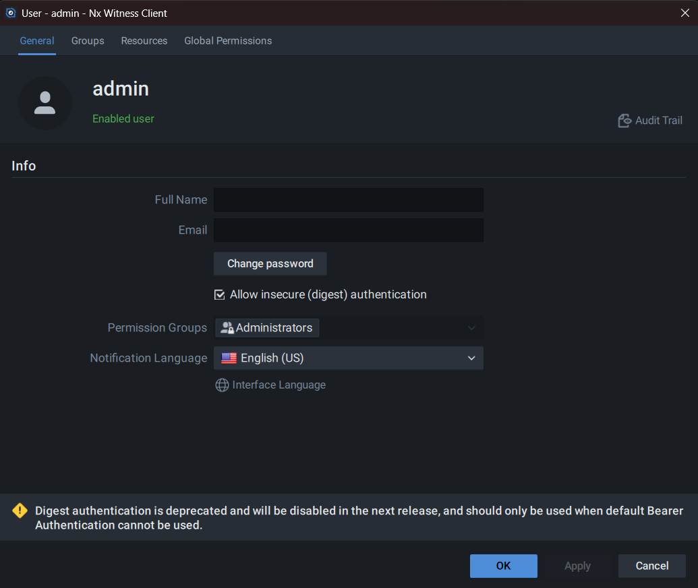
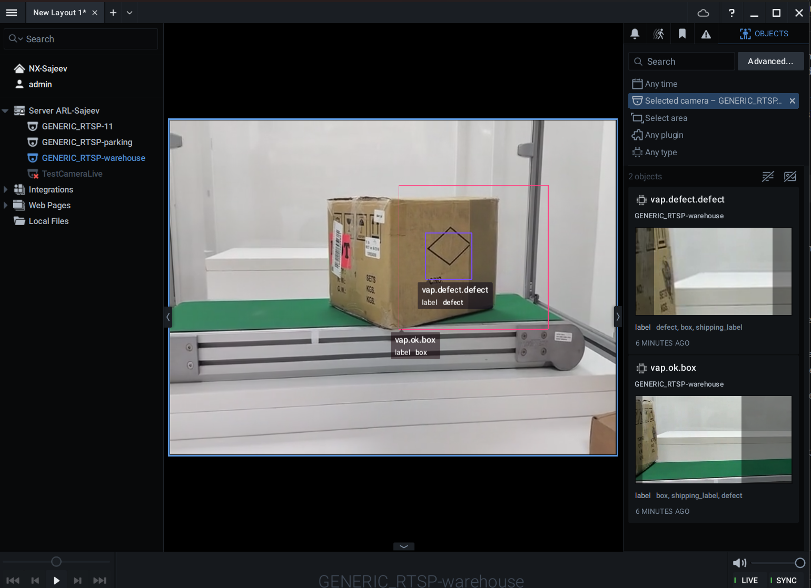

# Tutorial: Pallet Defect Detection with Nx Witness

This tutorial walks through the complete end-to-end setup of Pallet Defect Detection (PDD) as a Analytics App in VMS Adapter Plugin, with Nx Witness as the VMS. At the end of this tutorial you will have:

- PDD running with its MQTT broker exposed to the host
- Nx Witness connected to VAP and auto-registered as an analytics integration
- Detection bounding boxes pushed from PDD to Nx Witness in real time
- Pipeline runs managed from the VAP operator dashboard

## Prerequisites

- A host machine running Ubuntu 22.04 or 24.04 with Docker and Docker Compose installed.
- An Nx Witness server (version 5.x or above) accessible over the network from the VAP host. The Nx Witness admin credentials are required.
- The `edge-ai-suites` repository cloned (sparse or full):

  ```bash
  git clone --filter=blob:none --sparse --branch main https://github.com/open-edge-platform/edge-ai-suites.git
  cd edge-ai-suites
  git sparse-checkout set metro-ai-suite manufacturing-ai-suite
  ```

---

## Architecture Overview

```
Nx Witness VMS
  Camera device ─── RTSP stream ───────────────────────────────────────►┐
  (receives analytics       ◄─── REST push (bounding boxes) ────────────┤
   object overlays)                                                     │
                                                                        │
VMS Adapter Plugin (VAP)                                                │
  ┌──────────────────────────────────────┐                              │
  │  ObjectDetectionAnalyticsAppShim     │                              │
  │  ┌─────────────────────────────┐     │                              │
  │  │  POST /pipelines/{name}     ├───────────────────────────────────►│
  │  └─────────────────────────────┘     │   DLStreamer Pipeline Server │
  │                                      │   (PDD application)          │
  │  ┌─────────────────────────────┐     │       │                      │
  │  │  MqttSubscriber             │◄────────────┘  MQTT inference      │
  │  │  translate_dls_metadata()   │     │           results            │
  │  │  NxWitnessVmsShim.push()    ├───────────────────────────────────►│
  │  └─────────────────────────────┘     │
  └──────────────────────────────────────┘
                                         MQTT Broker (port 1883)
                                         (part of PDD stack)
```

**Key data flows:**

1. VAP sends `POST /pipelines/user_defined_pipelines/pallet_defect_detection_vms_mqtt` to the DLStreamer Pipeline Server, specifying the camera RTSP URL as source and an MQTT topic as destination.
2. PDD's DLStreamer Pipeline Server processes the RTSP stream, runs detection, and publishes inference metadata to the MQTT broker on topic `nx/pdd/{device_uuid}`.
3. VAP's `MqttSubscriber` receives the MQTT messages, translates DLStreamer GVA JSON to Nx analytics object format, and calls `NxWitnessVmsShim.push_analytics_objects()`.
4. Nx Witness receives the push and overlays bounding boxes on the camera feed.

---

## Part 1 — Set Up Pallet Defect Detection

### 1.1 Configure the PDD Environment

Navigate to the PDD application directory:

```bash
cd manufacturing-ai-suite/industrial-edge-insights-vision
cp .env_pallet-defect-detection .env
```

Edit `.env` and set the following required variables:

```bash
# IP address of the host machine where the DLStreamer Pipeline Server will run.
# This must be reachable from VAP and from the Nx Witness server.
HOST_IP=<YOUR_HOST_IP>

# The SAMPLE_APP must be set to pallet-defect-detection
SAMPLE_APP=pallet-defect-detection

# MinIO credentials (used for frame storage; required by the stack)
MINIO_ACCESS_KEY=intel1234
MINIO_SECRET_KEY=intel1234

# WebRTC credentials for MediaMTX (can be any string)
MTX_WEBRTCICESERVERS2_0_USERNAME=intel1234
MTX_WEBRTCICESERVERS2_0_PASSWORD=intel1234
```

### 1.2 Verify MQTT Port Exposure

The PDD Docker Compose stack includes an Eclipse Mosquitto MQTT broker. Confirm that port `1883` is published to the host in the `docker-compose.yml`:

```yaml
mqtt-broker:
  image: eclipse-mosquitto
  ports:
    - "1883:1883"
```

This is the default configuration. The Mosquitto broker uses an anonymous-access configuration (`allow_anonymous true`), which is required for VAP and the DLStreamer Pipeline Server to publish and subscribe without credentials.

> **Important:** VAP connects to this MQTT broker from outside the PDD Docker network. The broker must be reachable at `<HOST_IP>:1883` from the VAP container. If VAP runs on the same host, `host.docker.internal` resolves to the host from inside the VAP container.

### 1.3 Verify the VMS MQTT Pipeline Template

The pipeline template that VAP uses for Nx Witness integration is `pallet_defect_detection_vms_mqtt`. This pipeline uses `gvametapublish` to forward inference metadata to the MQTT broker. Confirm it is present in the PDD pipeline configuration:

```bash
cd [WORKDIR]/edge-ai-suites/manufacturing-ai-suite/industrial-edge-insights-vision

cat apps/pallet-defect-detection/configs/pipeline-server-config.json | python3 -c "
import json, sys
cfg = json.load(sys.stdin)
for p in cfg['config']['pipelines']:
    print(p.get('name'))
"
```

You should see `pallet_defect_detection_vms_mqtt` in the output. This pipeline:
- Accepts an RTSP source via `{auto_source}`.
- Runs `gvadetect` for object detection.
- Uses `gvametapublish` (the `destination` element) to publish inference results to the configured MQTT topic.

If NOT present, add the following to the pipeline config at `[WORKDIR]/edge-ai-suites/manufacturing-ai-suite/industrial-edge-insights-vision/apps/pallet-defect-detection/configs/pipeline-server-config.json`.

```json
            {
                "name": "pallet_defect_detection_vms_mqtt",
                "source": "gstreamer",
                "pipeline": "{auto_source} name=source ! decodebin3 ! gvadetect name=detection ! gvametaconvert add-empty-results=true add-rtp-timestamp=true name=metaconvert ! queue ! gvafpscounter ! queue ! gvametapublish name=destination ! appsink name=appsink",
                "parameters": {
                    "type": "object",
                    "properties": {
                        "detection-properties": {
                            "element": {
                                "name": "detection",
                                "format": "element-properties"
                            }
                        }
                    }
                },
                "auto_start": false
            }
```

### 1.4 Download Models and Start PDD

Run the setup script to download models and configure prerequisites:

```bash
./setup.sh
```

Start the PDD stack:

```bash
docker compose up -d
```

Verify all PDD services are running:

```bash
docker compose ps
```

Expected services: `dlstreamer-pipeline-server`, `mqtt-broker`, `mediamtx`, `minio`, `nginx`, and others depending on the configuration.

Verify the DLStreamer Pipeline Server is reachable and the pipeline template is loaded:

```bash
curl http://<HOST_IP>:8080/pipelines | python3 -m json.tool | grep '"name"'
```

You should see `pallet_defect_detection_vms_mqtt` in the list.

---

## Part 2 — Set Up Nx Witness

### 2.1 Install and Start Nx Witness Server

Install or start Nx Witness Server on a machine reachable from the VAP host. Refer to the [Nx Witness documentation](https://www.networkoptix.com/nx-witness/) for installation instructions.

After installation, verify the Nx Witness REST API is accessible:

```bash
curl -k -s https://<NX_HOST>:7001/rest/v4/info | python3 -m json.tool | grep '"name"\|"version"'
```

### 2.2 Enable Digest Authentication for RTSP

VAP constructs RTSP URLs in the following format and passes them directly to the DLStreamer Pipeline Server:

```
rtsp://<NX_USERNAME>:<NX_PASSWORD>@<NX_HOST>:7001/<device-uuid>?onvif_replay=true
```

The Nx Witness RTSP server is exposed on the **same port as the REST API** (default `7001`). It uses **digest authentication**, meaning the username and password embedded in the URL are verified with an MD5 challenge-response — credentials are never sent in plaintext over the wire.

For analytics applications such as DLStreamer to successfully connect to these RTSP URLs, two things must be confirmed in Nx Witness:

#### 2.2.1 Enable "Digest Authentication for RTSP" in System Settings

By default, newer Nx Witness versions restrict legacy RTSP clients to bearer-token auth only. To allow digest auth (which GStreamer's `rtspsrc` and most analytics frameworks require):

1. Open the **Nx Witness desktop client** and connect to your server.
2. Go to **Main Menu** (hamburger icon) → **User Managerment**. This opens the Site Administration window.
3. Select the user you would like the VAP to connect to. This should open the User window.
4. Under Info, check **Allow insecure (digest) authentication**. Re-enter you current password, click **OK**.
5. Click **Apply**.



> **Why this is needed:** GStreamer's `rtspsrc` element (used by DLStreamer) negotiates authentication via the standard RTSP `DESCRIBE` challenge. If Nx only accepts bearer tokens (HTTP Authorization header), the GStreamer client cannot authenticate and the pipeline immediately fails with `401 Unauthorized`.

#### 2.2.2 Confirm the User Has "View Live Video" Permission

>NOTE: Ignore the following if the `NX_USERNAME` is an administrator

The credentials embedded in the RTSP URL (`NX_USERNAME` / `NX_PASSWORD`) must belong to a user with at least **Live Viewer** role on all cameras used for analytics.

To verify or assign the role in the Nx Witness client:
1. Go to **Main Menu** → **User Management** (or **System Administration** → **Users**).
2. Find the user account matching `NX_USERNAME`.
3. Confirm the role is **Live Viewer**, **Advanced Viewer**, or **Administrator**.
4. If you are using a dedicated service account (recommended over using the `admin` account directly), ensure the account is assigned to all relevant camera groups.

#### 2.2.3 Verify RTSP Access from the Analytics Host

Before starting the full pipeline, verify the RTSP URL is reachable from the machine that will run the DLStreamer Pipeline Server:

You can test with GStreamer directly:

The device-uuid can be found from the Nx Witness client. Right click a camera from the list, choose **Camera Settings**. In the camera settings window, under **General** tab, look for the **Camera ID**

To run this test in a DLStreamer Pipeline Server container:

```bash
docker run -it --entrypoint bash  --rm --net host  intel/dlstreamer-pipeline-server:latest
```

Then run the GStreamer command:

```bash
gst-launch-1.0 rtspsrc \
  location="rtsp://<NX_USERNAME>:<NX_PASSWORD>@<NX_HOST>:7001/<device-uuid>?onvif_replay=true" \
  ! fakesink
```

A pipeline that runs for a few seconds without errors confirms the RTSP connection is working.

### 2.3 Add Cameras to Nx Witness

In the Nx Witness desktop client:
1. Open **Server** → **Add Device** (or right-click the server in the resource tree).
2. Add cameras by entering their RTSP URLs or by using auto-discovery on the network.
3. Confirm each camera appears in the resource tree and shows a live feed.

Note the **Device ID** (UUID) of each camera you intend to use. You can find this in:
- Nx Witness desktop client: right-click a camera → **Camera Settings** → **Information** tab.
- Or via the REST API:

  ```bash
  curl -k -u admin:<password> https://<NX_HOST>:7001/rest/v4/devices | python3 -m json.tool | grep '"id"\|"name"'
  ```

---

## Part 3 — Configure VAP for PDD + Nx Witness

### 3.1 Prepare the VAP Environment File

Navigate to the VAP directory:

```bash
cd metro-ai-suite/vms-adapter
cp .env.example .env
```

Edit `.env` with the following values for the PDD + Nx Witness scenario:

```bash
# PostgreSQL
PG_PASSWORD=changeme

# Nx Witness
NX_HOST=<NX_HOST_IP>
NX_USERNAME=admin
NX_PASSWORD=<nx_admin_password>

# PDD / DLStreamer Pipeline Server
# Hostname as seen from inside the VAP container.
# If PDD runs on the same host: use host.docker.internal
PDD_HOST=host.docker.internal
PDD_PORT=8080

# MQTT Broker — address as seen by VAP (subscribing from outside the PDD Docker network)
# If PDD runs on the same host: use host.docker.internal
MQTT_HOST=host.docker.internal
MQTT_PORT=1883

# PIPELINE_SERVER_MQTT_HOST — address as seen by the DLStreamer Pipeline Server
# container inside the PDD Docker network.
# The GStreamer Paho C MQTT client cannot resolve Docker service names across networks.
# Use the host machine's LAN IP — this is the most reliable choice because port 1883
# is published from the mqtt-broker container to the host, making it reachable from
# any container regardless of which Docker network it belongs to.
#
# Find your host LAN IP:
#   hostname -I | awk '{print $1}'
#
# DO NOT use 172.18.0.1 (the default Docker bridge gateway) unless you have confirmed
# that the PDD containers are on that exact subnet.
PIPELINE_SERVER_MQTT_HOST=<HOST_LAN_IP>
PIPELINE_SERVER_MQTT_PORT=1883

# VAP ports
BACKEND_PORT=8085
UI_PORT=3100

# MQTT Broker host for VAP's own broker (used by LVC; leave empty if not using LVC)
MQTT_BROKER_HOST=
MQTT_BROKER_PORT=1883
```

> **Finding your host LAN IP:**
> ```bash
> hostname -I | awk '{print $1}'
> ```
> Use this value for `PIPELINE_SERVER_MQTT_HOST`. It is reachable from any Docker container
> because port `1883` is published from the `mqtt-broker` container to the host.
> Avoid using `172.18.0.1` (the default Docker bridge gateway) — it only works if the
> PDD containers are on that exact subnet, and this is not guaranteed.

### 3.2 Configure VAP `config.yaml`

Open `config/config.yaml` and ensure the following sections are correctly configured. The file uses `${ENV_VAR}` placeholders resolved from `.env` at startup.

**Nx Witness VMS instance:**

```yaml
vms_instances:
  - name: nx-main
    vendor: nx_witness
    base_url: "https://${NX_HOST}:7001"
    auth:
      username: "${NX_USERNAME}"
      password: "${NX_PASSWORD}"
      auth_type: digest
    analytics_manifest_path: "vms_shim/nxwitness/nx_integration.json"  # optional: override bundled default
```

The `analytics_manifest_path` is **optional**. VAP automatically uses the bundled manifest at `vms_shim/nxwitness/nx_integration.json` when this field is absent. Set it only if you need to supply a custom manifest.

**PDD Analytics App:**

```yaml
analytics_apps:
  - type: object_detection
    app_id: "pdd"
    display_name: "Pallet Defect Detection"
    base_url: "http://${PDD_HOST:-host.docker.internal}:${PDD_PORT:-8080}/pipelines"
    mqtt_host: "${MQTT_HOST:-host.docker.internal}"
    mqtt_port: ${MQTT_PORT:-1883}
    pipeline_server_mqtt_host: "${PIPELINE_SERVER_MQTT_HOST}"
    pipeline_server_mqtt_port: ${PIPELINE_SERVER_MQTT_PORT:-1883}
    label_type_map:
      defect: vap.defect.defect
      box: vap.ok.box
      shipping_label: vap.shipping_label
```

### 3.3 Configure the `label_type_map`

The `label_type_map` translates DLStreamer detection labels (from the model) into Nx Witness object typeIds. These typeIds are automatically added to the Nx analytics manifest at startup, so Nx knows which object types to expect.

**How it works:**
- When PDD detects a `"defect"`, VAP pushes it to Nx as typeId `"vap.defect.defect"`.
- Nx renders this as an object overlay on the camera feed with the label `"vap.defect"`.
- Labels not listed in the map fall back to `"python.detected.object"`.

**Customize for your model:** If your model detects labels different from the the ones listed above (for example, `"car"`,`"person"`, etc.), add them to the map.

```yaml
label_type_map:
      car: vap.vehicle
      truck: vap.vehicle
      bus: vap.vehicle
      motorcycle: vap.vehicle
      bicycle: vap.vehicle
      van: vap.vehicle
      person: vap.person
      pedestrian: vap.person
```

Any `vap.*` typeId you add here is automatically registered in the Nx manifest. You do not need to manually edit `vms_shim/nxwitness/nx_integration.json`.

---

## Part 4 — Start VAP and Verify Nx Integration Registration

### 4.1 Build and Start VAP

```bash
docker compose up -d --build
```

Check that all VAP services are healthy:

```bash
docker compose ps
```

Expected:

```
NAME              STATUS
vms-backend       Up (healthy)
vms-ui            Up
postgres          Up (healthy)
```

### 4.2 Understand Automatic Integration Registration

When VAP starts, the Orchestrator automatically registers the analytics integration with Nx Witness. You do not need to register it manually. The process is:

1. VAP reads the integration manifest — the bundled `vms_shim/nxwitness/nx_integration.json` by default, or a custom path if `analytics_manifest_path` is set in `config.yaml`.
2. Any `label_type_map` entries from `config.yaml` are merged into the manifest automatically (so Nx knows all typeIds without manual edits).
3. VAP calls `POST /rest/v4/analytics/integrations/*/requests` on the Nx API.
4. VAP immediately approves the request via `POST .../requests/{requestId}/approve`.
5. Nx returns integration user credentials (`username`, `password`), which VAP stores in PostgreSQL and uses for subsequent metadata pushes.

Verify in the VAP logs:

```bash
docker compose logs vms-backend | grep -i "nx_integration\|autoregist"
```

You should see entries like:

```
nx_integration_approved username=DLStreamerAnalyticsIntegrationVMS request_id=...
nx_integration_autoregistered vms=nx-main analytics_app_id=DLStreamerAnalyticsIntegrationVMS status=approved
```

> **If VAP has already registered before** (database record exists and integration exists in Nx), VAP restores the integration credentials from its database and skips re-registration. You will see:
> ```
> nx_integration_already_registered vms=nx-main analytics_app_id=DLStreamerAnalyticsIntegrationVMS
> nx_integration_credentials_restored vms=nx-main username=DLStreamerAnalyticsIntegrationVMS
> ```

### 4.3 Verify the Integration in Nx Witness

To confirm the integration was registered, check via the Nx Witness REST API:

```bash
curl -k -u admin:<password> https://<NX_HOST>:7001/rest/v4/analytics/integrations \
  | python3 -m json.tool | grep '"name"\|"id"\|"status"'
```

You should see an integration named `DLStreamerAnalyticsIntegrationVMS` with `"status": "active"` or equivalent.

In the Nx Witness desktop client, navigate to **System Administration** → **Analytics** (or **Plugins**) to see the integration listed.

---

## Part 5 — Enable the Analytics Integration for a Camera

Before VAP can push detection overlays to a specific camera, the analytics integration must be enabled for that camera device in Nx Witness. VAP does this automatically on the first metadata push for a device (by calling `PATCH /rest/v4/analytics/engines/{engineId}/deviceAgents/{deviceId}` with `{"isEnabled": true}`), but you can also enable it manually in advance.

### 5.1 Enable via the Nx Witness Desktop Client

1. In the Nx Witness client, right-click the camera in the resource tree.
2. Select **Camera Settings**.
3. Go to the **Integrations** tab.
4. Find **DLStreamerAnalyticsIntegrationVMS** in the list.
5. Toggle the switch to **Enable**.
6. Click **Apply** or **OK**.

Repeat for each camera you plan to use with PDD.

### 5.2 Enable via the Nx Witness REST API (Optional)

First, get the analytics engine ID:

```bash
ENGINE_ID=$(curl -k -u admin:<password> \
  https://<NX_HOST>:7001/rest/v4/analytics/engines \
  | python3 -c "
import json, sys
engines = json.load(sys.stdin)
for e in engines:
    if 'DLStreamer' in e.get('name', ''):
        print(e['id'])
")
echo "Engine ID: $ENGINE_ID"
```

Enable the integration for a specific camera device:

```bash
DEVICE_ID=<camera-device-uuid>

curl -k -u admin:<password> \
  -X PATCH \
  -H "Content-Type: application/json" \
  -d '{"isEnabled": true}' \
  "https://<NX_HOST>:7001/rest/v4/analytics/engines/${ENGINE_ID}/deviceAgents/${DEVICE_ID}"
```

A `200 OK` response confirms the device agent is enabled.

> **Note:** VAP also performs this step automatically on the first push for a device (lazy enablement). If you start a pipeline run before enabling manually, VAP will enable the device agent and push the manifest on the first detection.

---

## Part 6 — Discover Cameras and Launch a Pipeline Run from the VAP Dashboard

### 6.1 Open the Operator Dashboard

Open a browser and navigate to:

```
http://localhost:3100
```

The dashboard loads and connects to the VAP backend at `http://localhost:8085/v1`.

### 6.2 Discover Cameras from Nx Witness

1. In the **Camera Discovery** panel on the left, click **Discover Cameras**.
2. VAP queries the Nx Witness REST API (`GET /rest/v4/devices`) and stores discovered cameras in PostgreSQL.
3. The camera list updates. Each Nx camera appears with its name and the prefix `nx:` followed by its UUID, for example: `nx:e3e9a385-7fe0-3ba5-5482-a86cde7faf48`.

Alternatively, trigger discovery via the API:

```bash
curl -X POST http://localhost:8085/v1/cameras/discover
```

### 6.3 Enable a Camera for Analytics

In the **Camera Discovery** panel, find the camera you want to use. Click the toggle next to it to mark it as **enabled**. Only enabled cameras appear in the analytics run form.

You can also enable a camera via the API:

```bash
curl -X POST http://localhost:8085/v1/cameras/enable \
  -H "Content-Type: application/json" \
  -d '{"camera_ids": ["nx:<device-uuid>"], "enabled": true}'
```

### 6.4 Configure and Start a PDD Pipeline Run

1. In the **Analytics Engine** panel, click **Discover Apps**. Depending upon your configuration you should see **Pallet Defect Detection** in the Analytics App section. Click the radio button.

2. The configuration form appears with the following fields:

   | **Field**          | **Description**                                               |
   |--------------------|---------------------------------------------------------------|
   | **Pipeline**       | Dropdown listing available pipeline templates from PDD        |
   | **Camera**         | Dropdown listing enabled cameras discovered from Nx Witness   |
   | **Pipeline parameters** | Optional JSON object forwarded to the Pipeline Server    |

3. Select the target camera from the **Camera** dropdown (for example, `Warehouse Camera 1`).

4. Select `pallet_defect_detection_vms_mqtt` from the **Pipeline** dropdown.

   > This is the pipeline template that uses `gvametapublish` to forward inference metadata to the MQTT broker. Other templates (for example, `pallet_defect_detection_mqtt`) are for internal PDD use only and do not forward metadata to VAP.

5. Optionally, set **Pipeline parameters** as a JSON object to override detection properties, for example:

   ```json
    {
      "detection-properties": {
          "model": "/home/pipeline-server/resources/models/pallet-defect-detection/deployment/Detection/model/model.xml",
          "device": "GPU"
      }
    }
   ```

6. Click **Start Analysis**.

### 6.5 What Happens When You Click Start

When you click **Start Run**, VAP executes the following:

1. Resolves the selected `camera_id` (`nx:<uuid>`) to an RTSP URL via `NxWitnessVmsShim.get_live_stream_url()`.
2. Builds an MQTT publish topic: `nx/pdd/<device-uuid>` (the topic where PDD publishes and VAP subscribes).
3. Sends `POST /pipelines/user_defined_pipelines/pallet_defect_detection_vms_mqtt` to the DLStreamer Pipeline Server with the payload:

   ```json
   {
     "source": {
       "uri": "rtsp://admin:<password>@<NX_HOST>:7001/<device-uuid>",
       "type": "uri",
       "properties": {"protocols": "tcp", "add-reference-timestamp-meta": true, "latency": 100}
     },
     "destination": {
       "metadata": {
         "type": "mqtt",
         "host": "<PIPELINE_SERVER_MQTT_HOST>:1883",
         "topic": "nx/pdd/<device-uuid>"
       }
     },
     "parameters": {
        "detection-properties": {
          "model": "/home/pipeline-server/resources/models/pallet-defect-detection/deployment/Detection/model/model.xml",
          "device": "GPU"
      }
     }
   }
   ```

4. The Pipeline Server starts the GStreamer pipeline, consuming the RTSP stream and publishing inference results to the MQTT broker.
5. VAP's `MqttSubscriber` (running as a background task since startup) receives messages on the wildcard topic `+/pdd/+`.

### 6.6 Verify the Run Is Active

Check active runs in the dashboard **Analytics Engine** panel — the run should appear in the active runs list.

Or via the API:

```bash
curl http://localhost:8085/v1/analytics-apps/pdd/runs | python3 -m json.tool
```

Check the Pipeline Server directly:

```bash
curl http://<HOST_IP>:8080/pipelines/status | python3 -m json.tool
```

---

## Part 7 — Observe Detection Overlays in Nx Witness

### 7.1 Open the Camera in Nx Witness Client

1. Open the Nx Witness desktop client and connect to your server.
2. Double-click the camera that you started the pipeline for.
3. The live video feed opens in a layout panel.
4. Click the Object Search(Alt+O) button

### 7.2 Verify Detections Are Appearing

Within a few seconds of starting the run, detection bounding boxes should appear overlaid on the video feed:

- Each detected object (for example, `box`, `defect`, `shipping_label`) is shown as a colored rectangle.
- The label shows the Nx `typeId` (for example, `vap.ok.box`, `vap.defect.box`, or `python.detected.object` for unmapped labels).



If detections do not appear, see the [Troubleshooting](#troubleshooting) section.

### 7.3 Stop the Pipeline Run

When you want to stop the detection, go back to the VAP dashboard **Analytics Engine Conguration** panel for **Pallet Defect Detection** and click **Stop Analysis** on the active run.

Or via the API:

```bash
curl -X DELETE http://localhost:8085/v1/analytics-apps/pdd/runs/<run_id>
```

This sends `DELETE /pipelines/<instance_id>` to the DLStreamer Pipeline Server, stopping the GStreamer pipeline. The MQTT subscriber remains running (it reconnects on the next run start).


### 7.4 Stop the plugin

To stop the VAP, 

```bash
docker compose down
```
 

> **CAUTION**: Be careful not to remove the volume, by `docker compose down -v` as this will delete the DB, as well as any integration info, credentials you created. If done, then the integration in Nx would be stale. Either delete from the Nx Witness, or use a different VMS integration name in `vms_shim/nxwitness/nx_integration.json` file.

---

## Troubleshooting

### Nx Integration Not Registered

**Symptom:** VAP logs show `nx_integration_exists_in_vms_not_in_db` or `nx_integration_exists_in_db_not_in_vms`.

**Cause:** The Nx integration and the VAP database are out of sync (for example, the integration was manually deleted from Nx, or the VAP database was cleared).

**Fix:**
1. In the Nx Witness client, delete the `DLStreamerAnalyticsIntegrationVMS` integration from **System Administration** → **Analytics**.
2. Drop the VAP integration record from the database:

   ```bash
   docker compose exec postgres psql -U vms -d vms_plugin \
     -c "DELETE FROM nx_integrations WHERE vms_name = 'nx-main';"
   ```

3. Restart VAP to trigger fresh registration:

   ```bash
   docker compose restart vms-backend
   ```

### Detections Not Appearing in Nx

**Symptom:** Pipeline run is active, PDD logs show detections, but no overlays appear in Nx.

**Checks:**

1. Verify VAP's MQTT subscriber is receiving messages:

   ```bash
   docker compose logs vms-backend | grep "mqtt_pushed_objects\|mqtt_no_objects\|mqtt_push_failed"
   ```

2. Confirm the MQTT topic matches. VAP subscribes to `+/pdd/+`. PDD publishes to the topic VAP sends in the pipeline start payload (`nx/pdd/<device-uuid>`). Both must match.

3. Check `PIPELINE_SERVER_MQTT_HOST` in `.env`. This must be the **host machine's LAN IP**, not a Docker container name or `host.docker.internal`. The GStreamer Paho C MQTT client inside the Pipeline Server container cannot resolve Docker service names, and `172.18.0.1` (the default Docker bridge gateway) is only valid if the PDD containers happen to be on that exact subnet.

   Find the correct value:
   ```bash
   hostname -I | awk '{print $1}'
   ```

   Update `.env` and restart VAP:
   ```bash
   # In metro-ai-suite/vms-adapter/.env
   PIPELINE_SERVER_MQTT_HOST=<output of hostname -I | awk '{print $1}'>
   docker compose restart vms-backend
   ```

4. Verify MQTT connectivity from the VAP side:

   ```bash
   # Install mosquitto-clients if not present
   sudo apt-get install -y mosquitto-clients
   mosquitto_sub -h <HOST_IP> -p 1883 -t '#' -v
   ```
   Start a pipeline run and check if messages appear.

5. Confirm the analytics integration is enabled for the camera in Nx Witness (see [Part 5](#part-5--enable-the-analytics-integration-for-a-camera)).

6. Check the Nx push in VAP logs:

   ```bash
   docker compose logs vms-backend | grep "nx_push\|push_analytics\|device_agent"
   ```

### Pipeline Server Returns Error on Start

**Symptom:** Clicking **Start Run** shows an error; VAP logs show a non-2xx from the Pipeline Server.

**Checks:**
- Confirm `PDD_HOST` and `PDD_PORT` in `.env` are reachable from inside the `vms-backend` container:

  ```bash
  docker compose exec vms-backend curl http://${PDD_HOST}:${PDD_PORT}/pipelines
  ```
- If PDD uses HTTPS (for example, via nginx on port 443), update `base_url` in `config.yaml` accordingly.
- Verify `pallet_defect_detection_vms_mqtt` appears in the pipeline list returned by `GET /pipelines`.

### RTSP Stream Not Reachable from PDD

**Symptom:** Pipeline starts but immediately fails; DLStreamer logs show RTSP connection errors.

**Checks:**
- The Nx RTSP URL includes credentials and is formed as `rtsp://admin:<password>@<NX_HOST>:7001/<device-uuid>?onvif_replay=true`. Confirm this URL is reachable from the PDD Docker network.
- If DLStreamer logs show `401 Unauthorized`, digest authentication is not enabled in Nx Witness. Enable it in **System Administration** → **Security** → **Allow digest authentication for cameras** and retry. See [Part 2.2](#22-enable-digest-authentication-for-rtsp) for details.
- Add `<NX_HOST>` to `no_proxy` in the PDD environment if a proxy is configured.

---

## Summary

| **Step**                                     | **Where**                              |
|----------------------------------------------|----------------------------------------|
| Start PDD with MQTT exposed on port 1883      | PDD `docker compose up -d`            |
| Configure Nx Witness connection in VAP `.env` | `metro-ai-suite/vms-adapter/.env`     |
| Configure `label_type_map` in `config.yaml`   | `config/config.yaml`                  |
| Start VAP (integration auto-registers)        | `docker compose up -d --build`        |
| Enable integration for cameras in Nx          | Nx Witness client → Camera Settings   |
| Discover cameras in VAP dashboard             | Dashboard → Discover Cameras          |
| Enable cameras in VAP dashboard               | Dashboard → Camera toggle             |
| Start a pipeline run                          | Dashboard → Analytics Engine → Start  |
| View detection overlays                       | Nx Witness client → live camera feed  |
| Stop the run                                  | Dashboard → Analytics Engine → Stop   |
